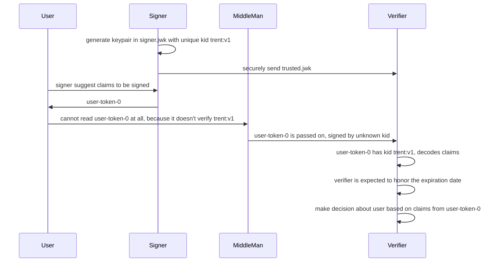
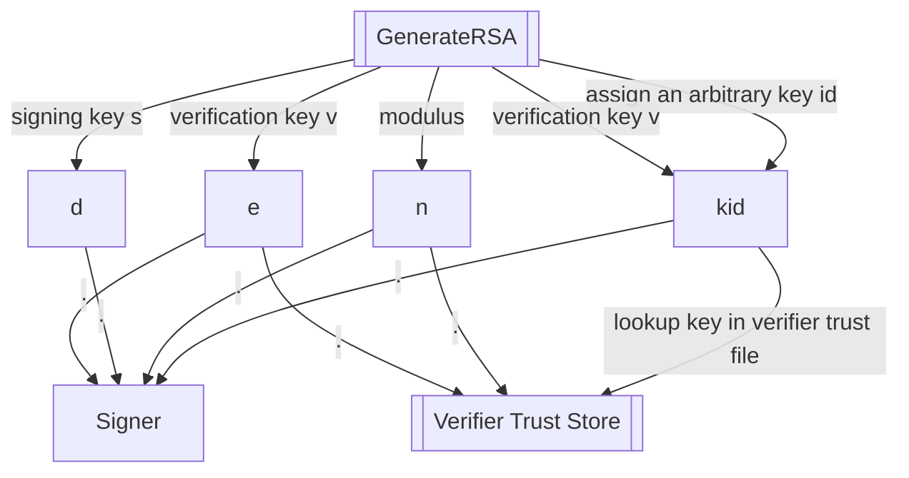
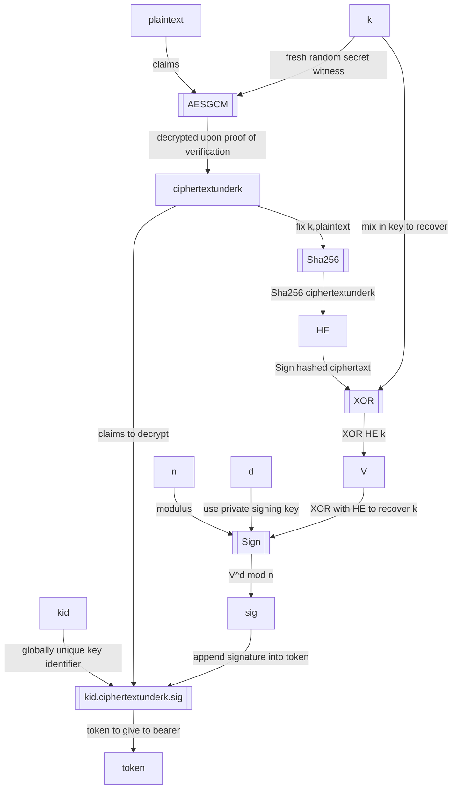
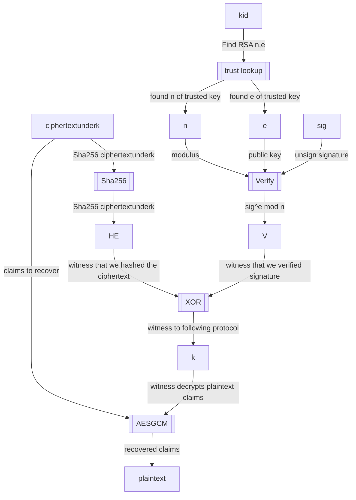

Whiskey Tango
=============


This is a simplified web token format that has the property that you can't get aaccess to the claims unless you followed the correct signature check protocol.  Most of the problems with JWT have to do with the fact that its design allows a large number of hazardous practices.

- JWT has a complex RFC that goes beyond the simple and easy to understand uses of jwt.io, making it difficult to implement correctly.

- When correctly implemented, JWT is full of hazards that should be disabled completely.  So this implies that implementing the full standard is a security hazard.

- One hazard is that the JWT algorithm is specified by the token.  A trivial to forge token such as an `alg:None` token is considered valid.  Things like this make JWTs hazardous to handle.

- The other hazard is that it is possible to retrieve JWT claims without bothering to check the signature.  The format encourages this.  Because JWTs are checked from many languages, it's highly probable that some clients will just extract the claims and hope that somebody else did the signature check; if they even care.

- Another hazard is that the JWT itself tells a client where to download the trust for the file.  The token should not be telling you where to do this, because real libraries deal with this by automatically downloading the trust of unknown files.  This completely defeats the point of doing a signature check in the first place.  A better idea is that if you have a trust store, such as a JWK, you may want to have the trust file add information to help rotate to new signing keys.  This means that the trust file, that you actually trust; tells you how to do this, instead of a JWT that you don't trust.  This basically means that the `alg` field should go away from JWT, and the details of how signing happens should be in the trust file that includes a JWK.

Encrypted JWTs involve a complex specification in JOSE, that just compounds the complexity problem associated with JWT hazards.  There are many situations where the CA has the signing key, and only clients allowed to decrypt the claims need to check the validity of those claims.  So, the public keys to verify a JWT can actually be secrets in that situation.

## Prerequisites

- Go 1.16 or higher
- jq
- python3 (optional) with cryptography installed

```bash
go mod tidy
pip3 install cryptography # optional for python
```

```bash
./cmd/whiskeyTango/test.sh
./py/test.sh # if using python
```

## Motivation

How would you feel about an encryption cipher that relied on client implementations to not fail?  Imagine such a cipher: The encryptor of the message does everything according to specification, and does not leak the secret key `k` for `ciphrtextunderk` that will decrypt to `plaintext`.  Yet, somebody implemented a decrypt cipher that manages to extract `plaintext` without knowledge of `k`.


We tolerate exactly this situation with digital signatures.  And it is completely unnecessary.  In the hands of programmers that are just trying to get work done, this is very hazardous.  If a way is found to extract `plaintext` without bothering with cryptography, that is exactly what they will do.  We tolerate constructions like this for signing:

```
signedplaintext = {plaintext, Sign(Hash(plaintext))}

plaintext = signedplaintext[0]

verified = (Hash(plaintext) == Verify(signedplaintext[1]))
```

If we didn't have the keys to perform verification, we can simply lie and claim that we verified `plaintext`.  This is similar to being able to extract `plaintext` from a cipher and lie about getting the information by decrypting it.  This problem is caused by leaking the plaintext before verification begins.  You should get no information without a verification.

The idea is to use the signature not to produce a hash of the plaintext for a comparison; but to use the signature to produce a witness that the ciphertext has not been modified.  And only that witness to following protocol can give us `plaintext`.

What is important is that we _do_ _not_ rely on a correct client.  An incorrect client verification will simply fail to read what has been signed.  We need this behavior out of an encryption cipher; and signatures should work the same way.  This prevents us from making critical decisions based on data that is supposed to have been proven genuine. 
```
# a witness is a random value we want as proof
ciphertext = encrypt(witness, plaintext)
signedciphertext = {ciphertext, sig = (Sign(Hash(ciphertext) xor witness))}

ciphertext = signedciphertext[0]

witness = Hash(ciphertext) xor Verify(sig)

plaintext = decrypt(witness, ciphertext) 
```

So, getting your hands on the plaintext is proof that you followed the signature verification protocol.  If you think about it, the only motivation for giving the user the plaintext and the signature, is so that they can skip the verification step if they wish to(!).

An interesting side-effect of doing this is that we can look at schemes like RSA in a new way.  Instead of thinking of strictly private, and totally public keys; we can think of it as an _asymmetric_ cipher, and leave it up to the user to make one of the keys public.  If one key `(n,d)` is reserved for the signer, and the other key is reserved for the verifier and signer to have `(n,e)`, then it is possible that signing and verification are only possible for those given the keys to act in those roles.  That would admit situations where the bearer of the token, nor middle-men passing the tokens around can decrypt them.  Therefore, tokens can have secrets sent from signer to verifier.  This could be derogatory information about a bearer, or passwords for resources that the bearer should not be given.

- bearer asks signer for a token.  But signer must mark bearer ineligible for certain uses that bearer is unaware of.  But the verifier is allowed to know.
- bearer asks signer for a token.  But signer may need to include information that verifier needs to know, but bearer does not want in the token.

Because of this, we could weakly handle this by following common RSA usage that makes `e` a globally well-known constant. But it may be possible to deduce the modulus `n` from multiple instances of tokens.  So it would be safer to also make `e` just as secret as `d` is.  Here we are taking advantage of the symmetric nature of raw RSA.

> Note that this has nothing to do with using the same key for sign and encrypt, when RSA is used in the scheme where `e` is forced to be public.  The point of making `e` as secret as `d` is to avoid exactly that well-known problem.  Because `e` and `d` commute, the RSA key can't be used for both signing and encryption.  But that's only when the RSA key `e` is well known that this issue arises.


## Token flow

Tokens are digitally signed claims about a user.  This is an example of what is being digitally signed.  The signed information flows between actors in a system:



> Note: it is possible to use normal RSA with normal public keys.  With completely public keys (ie: hardcoded `e` value), it may be possible for those not explicitly given permission to verify signatures to do so.  This may be fine for most applications.  But a goal is to support "signcrypted" tokens.  The signer may only give out public keys to verify tokens to specific verifiers.  This allows for possibilities such as derogatory secrets in tokens that verifiers need to know, but their owners do not. It also protects tokens from snooping by middle-men. So, the RSA keypairs are issued different from standard.  A way to speed up RSA is to use a very tiny public key that is an actual hardcoded value, because they are assumed to be totally public.  But we use a form of RSA where both keys are private, like ends of a pipe.  One end is for signing claims, and the other end is for decrypting verified claims.

> TODO: it is possible to embed public keys into the signed tokens, so that verifiers can challenge senders for proof of ownership of the token.  Normally, tokens rely on expiration dates to limit the "blast radius" of leaks.  There will need to be application-specific audiences built into claims, so that if a token is sent to a location where it is not honored; the token can be rejected.  This is similar to us relying on clients to honor expiration dates.  It is possible to decrypt an expired token, or a token that is supposed to honor some claims.  This is why the `kid` should be used to determine who can decrypt the claims, because that can be enforced.

# Tokens

Claims in a token should have an expiration date. They typically are a set of groups,
so that permission can be calculated with them.  Sometimes, they are basic things
such as a user's primary key, where groups still need a lookup somewhere else.

```json
{
  "exp": 1655843670,
  "groups": {
    "age": [
      "adult"
    ],
    "awards": [
      "cherryblossom-go-tournament",
      "best-dad"
    ],
    "email": [
      "rob.fielding@gmail.com",
      "rrr00bb@yahoo.com"
    ]
  },
  "kid": "usa:1234:1"
}
```

It needs to be digitally signed, because we will make critical security decisions based on it.  We can do that if we are given the trust file for the signer, which looks like this:

```json
{
  "kty": "RSA",
  "kid": "usa:1234:1",
  "n": "qeIhwbmDXoH_ngks_fexyDCBFI_kh8Q54vDefHi-dvIfqlOEOPiMqUd471muLhl5HNZy2laCULaNEaVvWm-eMpRTFwYgvP1ObCdTe5v9mvRUbPheob8j9vymj8skxmhcEEiMLsKx1OzrzClo5Knf7q7KI9SWZ-VOL9bedSh2-t2HPbWzHNNDPx0HZqTFCQhsWKvpqSlagom4qiE-_IUXoEuVe0wbiRH-pbgGal1Yfft5I45y1d_84SilG4ZuXTAxkdU3DjvHxZbJ0n6nMOQG07fJqTC62waSXNkvE6UdiZ-ItmSVsHBLTQevPvce2VVbugZJuROuXQdxiYomLcuYaQ",
  "e": "AQAB"
}
```

This way, if a token has that `kid` in its first part, we can use that semi-public key to decrypt the claims.  The way that the claims are encrypted, we have verified the signature of the signer; and that is the only way to get the claims.  Without the trust file, we have no idea what is in the token.

```
dXNhOjEyMzQ6MQ.EmIl5_1-rp260VkehZn74jXpuShgRArXgZr3YuRytf8c-iXxLRqdywIgshzrA1xI0FkdmR4x-nKdnBrrC_7POPCAcnH3kLsNb8vOo9fFw9OpoLoVbPP7SnDktMtTfNRq8jty8fDz8PqPpv0Vob2R1_-99spdpssPRMjuSXV2wAmSbCg4JVu12pdxLcP4Z9S-o_A9NFzV7475YuFearGZt8-bBcza2q8LqWfz6_xoWDZHk9v5zxx1gqq3yjHZ7Ov2zjmd3MtQaw.bY2VzbnlWqztLpAl4BMGsZ-6VobEoIeJ4K6T1djZJ5gpS4tICKfMvZolaMlTK_lhNH35q-hhq27tHgnjU-0lRAV1qiVQVodwH40i6tjQ6IxakZ7Fv12xu3O5uP8ksz1kCNqAKk3GktiLwG5pZT9eStNu2ncQ_EQfEJXrgAeO66aC1pON9nNh3wN59mlB2vFWPqk70G9X0KHWNxsNzKN0UZahNROk2qIMIErTAj5pNGkvwm9196LAcfgKEwZMNgREwrLe_4mZ37wXpN4XUVsvqwEgAzDo5EsyEC1iIZpp63b_mmsN4mVyCpyy4RmhsaD09ubpV_Q-ve1VLeLc-aRRew
```

## JWT in a nutshell

It is similar to a JWT in that there is a header, a body, and a signature.  But the header only has the `kid` value in it, the key id to look up the signing key.  The body is encrypted.  It requires an actual signature check to get enough information to extract the claims.  This way, a bad imlementation of this spec can only manage to ignore the expiration date.  The token is at least signed by a trusted signer.  We know this because the `kid` must have an entry for the key.  We don't have a mechanism to fetch unknown keys coming in from the tokens themselves.


The good part of JWT is the idea of a simple json object that is digitally signed.  The existing JWT specification goes roughly like this:


```
var header // a json chunk that includes alg, maybe kid, etc.
var claims // A json chunk that includes exp, issuer, etc.
var signature // a signatuer over header and claims, ensure no modifications.
jwt = join(".", [B64UEncode(header), B64UEncode(claims), B64UEncode(signature)]
```

This uses the common method of signature checking.  For RSA, the check would be this pattern:

```
signature = RSASign(priv, Sha256(plaintext))
signedPlaintext = (plaintext,signature)
```

This is a very common pattern in cryptograpy, to give the plaintext and a signed hash of the plaintext.  The problem with this pattern is that it is _consentual_ for the verifier to bother verifying the signature.  This is because it is easy for the verifier to skip the signature check entirely, and simply return the plaintext.  That is ok if the CA is not put at risk by clients that follow protocol.  But it's very easy to just extract that claims and not check the signature, and JWT tokens are used from many languages.  Many developers just don't care about the signatures, or the details of any libraries they are using.

## Avoid signatures that reveal plaintext before verification

### Setup CA

First, the CA has to have generated a key.  The trust files lack `d`, as that is private to the signer. Ideally, those who are not verifiers lack not only `e`, but `n` as well; as they have not been granted the verification keys. 



Note that in RSA, the public key is `(n,e)`, and the private key is `(n,d)`.  The signer has everything in `(n,d,e)`. The `kid` is just used to identify a unique `(n,d,e)` tuple.

### CA signs a A Token

We want a foolproof way of checking, such that if the client can even manage to get the plaintext, we are assured that the protocol was followed.  The only problem we have that we can't solve is verifying that the client actually checked an expiration date on a token.  But we can force the data to stay encrypted without a signature check, by forcing a signature check to produce a witness to decrypt the data.

> The RSA keypair (s,v) can also be called (e,d) for "encrypt" and "decrypt", and here I will use the RSA names for them

> Note that this is almost the same thing as just verifying the hash of the ciphertext.
But we can't use `HE = k` and removing the `XOR` for this purpose, because you can calculate `HE` without actually verifying the signature. An `XOR` with `k` prevents skipping the signature check, as this signature check generates a witness rather than relying on an honest result of a comparison.



### Verify a token



A CA is setup with a key:

```
# Assign some kind of name for keypair, the "key id"
kid = ArbitraryNameForKeypair()

# The RSA key pair that is used for (sign, verify):
(n,d,e) = RSAKeypair()

# the verify is "public" to those that are _allowed_ to decrypt the tokens.
# that means that `(n,e)` is not entirely public.  `d` is secret to the CA only.
```

A client will _trust_ a `kid` by mapping from `kid` to `e` in a JWK.
Unlike JWT, a key should be trusted prior to getting a token that uses it,
rather than downloading a key to trust it automatically when a token is recieved;
which is another way to defeat signature checks.

```
# the trusts map is generally a JWK file, where this is true
trusts[kid].e == e
```
	
When the CA is asked to sign claims, for clients that trust a `kid`,	
this is how a token is created by the CA, 
given `claims` for a `kid`, and a validity period:

```
# The witness key `k` that lets us decrypt the claims:
k = randomAESKey()

# Mandatory modifications to claims to ensure expiration,
# and allow lookup of issuer information
claims.exp = expirationDate(validityPeriod)
claims.kid = kid

## The algorithm to create a signature Sig for the claims
# encrypt the claims to the witness k
E = AESEncrypt(k, claims)
# a hash of the ciphertext
HE = Sha256(E)
# sign both k and ciphertext, so that we can recover k from HE and v
V = Xor(K, HE)
Sig = RSASign(d, V)
Token = join(".", map(B64E, [kid, E, Sig]))
```

That token will bear a superficial resemblance to a JWT token.  The differences,

- The header _only_ has the kid value in it.  Substituting a wrong value will cause the claims to fail to decrypt.  Importantly, it does not specify the algorithm, as once we look up a kid, all of that information should be in our trust store; as information that we already trust to be correct.

- The claims are encrypted.  If you were not given the trust entry for this kid, then you cannot decrypt it either.  So this token can contain secrets, so long as the trust is only given to clients entrusted to decode the claims; so the tokens don't leak information to intermediate services that see the token in headers.

When a client gets a token, it is required that the client posesses a JWK entry for kid.  Crucially, we don't give the client a method to look it up; which defeats the purpose of having a signature in the first place.  The client has: `token`, `trusts[kid]`.

```
kid = token.kid
E = token.E
#client does NOT have trusts[kid].d !!
e = trusts[kid].e 
HE = Sha256(E)
Sig = token.Sig
V = VerifyRSA(d,Sig)
k = Xor(V,HE)
claims = AESDecrypt(k, E)
```

Most signature checks simply trust that the client is defending itself and checking the signature.  But the sort of people handling JWTs will simply extract the claims without checking if that's possible; because it makes the code simpler.  So, we require that the signature check generate a witness in order to get the plaintext claims.

- k is the witness
- require that HE be produced by the client
- require that V be produce by the client, using VerifyRSA(e,Sig)
- Xor(V,HE) = Xor(Xor(k,HE),HE) = k
- k it a witness that the signature was checked, so we can decrypt claims. `claims = AESDecrypt(k, E)

It is unusual to do a setup that requires a witness that verification actually happened.  But if you are going to have encrypted tokens, the tokens need verification, and the claims need a decrypt.  This just means that the RSA public key that kid leads to is not _entirely_ public.  It's public to those allowed to verify the token.

## A Note About The Distinction Between Public-Key Cryptography versus Asymmetric Cryptography

If you want the signer to use a standard Public-Key Cryptography key for RSA, then pass in `-smalle` flag to get a small and standard `e` for the public RSA exponent.  If you do so, then there is a `public` key and a `private` key.  But RSA is capable of more than this.  With RSA, you can use both `e` and `d` exponents having the same properties; and both are private keys for different purposes.  The signer has `(n,d,e)`, and verifiers only have `(n,e)`.  It's almost the same as simply only distributing public keys to verifiers; except it _assumes_ that `n` may be easily figured out from looking at signed tokens.  In any case, `asymmetric` cryptography doesn't necessarily mean that one of the keys is `public`.  Therefore the value for the exponent that is usually public and a well known value is a value that can only be discovered by being given the full "public" key `(n,e)`.  This means that only the signer can create values, and we can limit who is allowed to verify signed values.

## Attempt To Forge Signatures

The value `V` is `HE xor k`.  But notice that `HE` is a function of `k`, because `(HE = Sha256(AESGCM(k,plaintext)))`.  So, if we try to choose a new `k` that gives us `V = (HE xor k)` to supply a different ciphertext, then we can't simply target the value `V` because when `k` changes, `HE` also changes.  Similarly, if we encrypt the `plaintext` we would like signed to produce a `HE`, then the key `k` is chosen when we produce `HE`.  We cannot arbitrarily choose a `k` that will decrypt `HE`.  If we could independently pick a `k` that causes us to yield the target `V`, then we would be able to forge signatures.


## Example output

This is an example of using the CLI from a bash shell.
Once the binary is made, and we cleaned out state from previous test runs,
we begin to use the Cli:

```bash

#!/bin/bash

(
cd `dirname $0`

echo --- compile binary
go build -o wt main.go

echo --- clean up
rm *.json

echo --- make ca
./wt -ca signer.json -kid rfielding-1 -create

echo --- trust signer rfielding-1
./wt -ca signer.json -kid rfielding-1 -trust trusted.json
cat trusted.json

echo --- sign token
echo '{"age":["adult"]}' | ./wt -ca signer.json -kid rfielding-1 -sign > token.wt
cat token.wt

echo --- verify token
cat token.wt | ./wt -ca trusted.json -verify
)
```

- `wt -ca signer.json -kid rfielding-1 -create` creates a fresh RSA keypair named rfielding-1.  The `signer.json` file is private to the signer.

- `wt -ca signer.json -kid rfielding-1 -trust trusted.json` says that the ca should export `rfielding-1` into the file `trusted.json`, but redact the signer's private key while doing so. This entry can only be used to verify tokens.

- `cat claims.json | wt -ca signer.json -kid rfielding-1 -sign > token.wt` means that whatever claims are passed in on stdin should be signed by signer.  Of course the signer should not just automatically do this!  Signer should read the claims and verify that they are true.  Claims will be things that need to be verified, such as who the user is, his attributes such as age, etc.  Such claims may come from, or be verified against a database of known attributes.

- Once this token is given back to the user, the user isn't necessarily allowed to decode it.  Some attributes might be derogatory, such as failed drug tests.

- `cat token.wt | wt -ca trusted.json -verify` extracts the claims about the user.  The signer knows the claims, and should have verified that they were true.  The user may not be able to decode these claims.  But since we were granted the RSA (less-than) public key, we can decode what these claims are.

The output when run is like:

```
>./cmd/whiskeyTango/test.sh 
--- compile binary
--- clean up
--- make ca
--- trust signer rfielding-1
{
  "keys": [
    {
      "kty": "RSA",
      "kid": "rfielding-1",
      "n": "qmCFmPNAT4G9M8D0yS6gFqKdD6eTF7ihFFnw8yPZTqGiI178GKvGu9LzmrpxDsQXCNVEETXWvmqcnTT3uyvSO5jEATsc0QREMwxZv-mZgLsl0VT-LTwDo-CFORTijoDuS8qgy0k7pL__Zjt7fY_EmdKnhcIq-xCAhmSGEweT6t87GDMZv1hg64vZLlUJeVtWQemZ4JbC7PJ6HLvsybnkVH3mGJNFW9Z49fezxTq19zSKng17bTpvyGRzkavKcQqDq8tJy755d9K_cA_DjI8nZfosh1UoqW3fBJwcHp5WRk-O9WXlE8smQ4JKUX7bjnjYa5ABWm46Ukaa24OL_vy8vQ",
      "e": "EpJieAbeEt7EdXTb48VV3SRuOzS8RV3vjtN_M3uCK25Nc0wzAZXum9fX_VBzn0N11ZUNqXuLRlgfbtXkokMEaYSl9WdZSrIEy8aBkYXUh5PfV89Dxo4jYLdRVzlZf5yygwSdM5LuV-f3jbDMTbncmOj3HOBFTdYvC7riELtZ0VpNeoi86ZPvbR4ecgFwXM1hZ_jSPz54JUG_YmmPU5RzggoHsW-VZJVMDII6d3nB5bn285EL4wtfELhnPy5X-FaYPeYlYqVdORBDB0K_TZuMzfC_zmD3pV9a-hvLfJMkyR10WrNMIc4NSejxFf7pfsC-Xuxc8RXoYOKq_2x3b1oAGQ"
    }
  ]
}--- sign token
cmZpZWxkaW5nLTE.IJzgfNjCrIUgPqdKSxprgYevIiudOwcUKi7TNlU7G0dvy7mssngXPaOAasZmjv5LPD6ixnGluVqlHMm4VPr8w40wYR7Kg0zgz8v8Hz_NzX1XHg.XC1oXdIOmoqikKGUPcRpvumqXPvikFyz2AyY2sOY01U8--O7y7yvJwkpeLKqvv66SoD3eEYB0NRXlKA8AEykLYpknq3lWy6IznuIQV7Hss48xGMH0xqJx0PuSaO8n_yQdZBPJE5wfADOnAR9zyAPEA4_skxnGWx1gxUtRUQFfpPF5iWj36kUCUUCWY1z_CsH3ze8vr0R3D7q0pMqyNV-7k05RdyL9FmRiEodZSik5w1BDGJl3XkSJ2j1Z8xSKySmWQupTWHzmH2W3eMOrgRnVAx8-DU-pNE8P3isJW6BG3fpiIF4-qFp4UWNwWCKL0tP6MbNK0IrqxpdEQxQtX3FwQ
--- verify token
{
  "age": [
    "adult"
  ],
  "exp": 1657777084,
  "kid": "rfielding-1"
}
```
