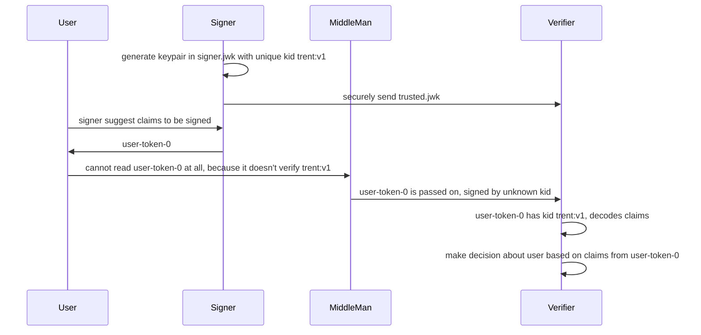

Whiskey Tango
=============

This is a simplified web token format that has the property that you can't get aaccess to the claims unless you followed the correct signature check protocol.  Most of the problems with JWT have to do with the fact that its design allows a large number of hazardous practices.

- JWT has a complex RFC that goes beyond the simple and easy to understand uses of jwt.io, making it difficult to implement correctly.

- When correctly implemented, JWT is full of hazards that should be disabled completely.  So this implies that implementing the full standard is a security hazard.

- One hazard is that the JWT algorithm is specified by the token.  A trivial to forge token such as an `alg:None` token is considered valid.  Things like this make JWTs hazardous to handle.

- The other hazard is that it is possible to retrieve JWT claims without bothering to check the signature.  The format encourages this.  Because JWTs are checked from many languages, it's highly probable that some clients will just extract the claims and hope that somebody else did the signature check; if they even care.

- Another hazard is that the JWT itself tells a client where to download the trust for the file.  The token should not be telling you where to do this, because real libraries deal with this by automatically downloading the trust of unknown files.  This completely defeats the point of doing a signature check in the first place.  A better idea is that if you have a trust store, such as a JWK, you may want to have the trust file add information to help rotate to new signing keys.  This means that the trust file, that you actually trust; tells you how to do this, instead of a JWT that you don't trust.  This basically means that the `alg` field should go away from JWT, and the details of how signing happens should be in the trust file that includes a JWK.

Encrypted JWTs involve a complex specification in JOSE, that just compounds the complexity problem associated with JWT hazards.  There are many situations where the CA has the signing key, and only clients allowed to decrypt the claims need to check the validity of those claims.  So, the public keys to verify a JWT can actually be secrets in that situation.


## Token flow

Tokens are digitally signed claims about a user.  This is an example of what is being digitally signed.  The signed information flows between actors in a system:



# Tokens

Claims in a token should have an expiration date. They typically are a set of groups,
so that permission can be calculated with them.  Sometimes, they are basic things
such as a user's primary key, where groups still need a lookup somewhere else.

```json
{
  "exp": 1655843670,
  "groups": {
    "age": [
      "adult"
    ],
    "awards": [
      "cherryblossom-go-tournament",
      "best-dad"
    ],
    "email": [
      "rob.fielding@gmail.com",
      "rrr00bb@yahoo.com"
    ]
  },
  "kid": "usa:1234:1"
}
```

It needs to be digitally signed, because we will make critical security decisions based on it.  We can do that if we are given the trust file for the signer, which looks like this:

```json
{
  "kty": "RSA",
  "kid": "usa:1234:1",
  "n": "qeIhwbmDXoH_ngks_fexyDCBFI_kh8Q54vDefHi-dvIfqlOEOPiMqUd471muLhl5HNZy2laCULaNEaVvWm-eMpRTFwYgvP1ObCdTe5v9mvRUbPheob8j9vymj8skxmhcEEiMLsKx1OzrzClo5Knf7q7KI9SWZ-VOL9bedSh2-t2HPbWzHNNDPx0HZqTFCQhsWKvpqSlagom4qiE-_IUXoEuVe0wbiRH-pbgGal1Yfft5I45y1d_84SilG4ZuXTAxkdU3DjvHxZbJ0n6nMOQG07fJqTC62waSXNkvE6UdiZ-ItmSVsHBLTQevPvce2VVbugZJuROuXQdxiYomLcuYaQ",
  "e": "AQAB"
}
```

This way, if a token has that `kid` in its first part, we can use that semi-public key to decrypt the claims.  The way that the claims are encrypted, we have verified the signature of the signer; and that is the only way to get the claims.  Without the trust file, we have no idea what is in the token.

```
dXNhOjEyMzQ6MQ.EmIl5_1-rp260VkehZn74jXpuShgRArXgZr3YuRytf8c-iXxLRqdywIgshzrA1xI0FkdmR4x-nKdnBrrC_7POPCAcnH3kLsNb8vOo9fFw9OpoLoVbPP7SnDktMtTfNRq8jty8fDz8PqPpv0Vob2R1_-99spdpssPRMjuSXV2wAmSbCg4JVu12pdxLcP4Z9S-o_A9NFzV7475YuFearGZt8-bBcza2q8LqWfz6_xoWDZHk9v5zxx1gqq3yjHZ7Ov2zjmd3MtQaw.bY2VzbnlWqztLpAl4BMGsZ-6VobEoIeJ4K6T1djZJ5gpS4tICKfMvZolaMlTK_lhNH35q-hhq27tHgnjU-0lRAV1qiVQVodwH40i6tjQ6IxakZ7Fv12xu3O5uP8ksz1kCNqAKk3GktiLwG5pZT9eStNu2ncQ_EQfEJXrgAeO66aC1pON9nNh3wN59mlB2vFWPqk70G9X0KHWNxsNzKN0UZahNROk2qIMIErTAj5pNGkvwm9196LAcfgKEwZMNgREwrLe_4mZ37wXpN4XUVsvqwEgAzDo5EsyEC1iIZpp63b_mmsN4mVyCpyy4RmhsaD09ubpV_Q-ve1VLeLc-aRRew
```

It is similar to a JWT in that there is a header, a body, and a signature.  But the header only has the `kid` value in it, the key id to look up the signing key.  The body is encrypted.  It requires an actual signature check to get enough information to extract the claims.  This way, a bad imlementation of this spec can only manage to ignore the expiration date.  The token is at least signed by a trusted signer.  We know this because the `kid` must have an entry for the key.  We don't have a mechanism to fetch unknown keys coming in from the tokens themselves.


The good part of JWT is the idea of a simple json object that is digitally signed.  The existing JWT specification goes roughly like this:

```
var header // a json chunk that includes alg, maybe kid, etc.
var claims // A json chunk that includes exp, issuer, etc.
var signature // a signatuer over header and claims, ensure no modifications.
jwt = join(".", [B64UEncode(header), B64UEncode(claims), B64UEncode(signature)]
```

This uses the common method of signature checking.  For RSA, the check would be this pattern:

```
signature = RSASign(priv, Sha256(plaintext))
signedPlaintext = (plaintext,signature)
```

This is a very common pattern in cryptograpy, to give the plaintext and a signed hash of the plaintext.  The problem with this pattern is that it is _consentual_ for the verifier to bother verifying the signature.  This is because it is easy for the verifier to skip the signature check entirely, and simply return the plaintext.  That is ok if the CA is not put at risk by clients that follow protocol.  But it's very easy to just extract that claims and not check the signature, and JWT tokens are used from many languages.  Many developers just don't care about the signatures, or the details of any libraries they are using.

We want a foolproof way of checking, such that if the client can even manage to get the plaintext, we are assured that the protocol was followed.  The only problem we have that we can't solve is verifying that the client actually checked an expiration date on a token.  But we can force the data to stay encrypted without a signature check, by forcing a signature check to produce a witness to decrypt the data.


A CA is setup with a key:

```
# Assign some kind of name for keypair, the "key id"
kid = ArbitraryNameForKeypair()

# The RSA key pair that is used for (sign, verify):
(s,v) = RSAKeypair()

# the verify is "public" to those that are _allowed_ to decrypt the tokens.
# that means that v is not entirely public.  s is secret to the CA only.
```

A client will _trust_ a `kid` by mapping from `kid` to `v` in a JWK

```
# the trusts map is generally a JWK file, where this is true
trusts[kid].v == v
```
	
When the CA is asked to sign claims, for clients that trust a `kid`,	
this is how a token is created by the CA, 
given `claims` for a `kid`, and a validity period:

```
# The witness key `k` that lets us decrypt the claims:
k = randomAESKey()

# Mandatory modifications to claims to ensure expiration,
# and allow lookup of issuer information
claims.exp = expirationDate(validityPeriod)
claims.kid = kid

## The algorithm to create a signature Sig for the claims
# encrypt the claims to the witness k
E = AESEncrypt(k, claims)
# a hash of the ciphertext
HE = Sha256(E)
# sign both k and ciphertext, so that we can recover k from HE and v
V = Xor(K, HE)
Sig = RSASign(s, V)
Token = join(".", map(B64E, [kid, E, Sig]))
```

That token will bear a superficial resemblance to a JWT token.  The differences,

- The header _only_ has the kid value in it.  Substituting a wrong value will cause the claims to fail to decrypt.  Importantly, it does not specify the algorithm, as once we look up a kid, all of that information should be in our trust store; as information that we already trust to be correct.

- The claims are encrypted.  If you were not given the trust entry for this kid, then you cannot decrypt it either.  So this token can contain secrets, so long as the trust is only given to clients entrusted to decode the claims; so the tokens don't leak information to intermediate services that see the token in headers.

When a client gets a token, it is required that the client posesses a JWK entry for kid.  Crucially, we don't give the client a method to look it up; which defeats the purpose of having a signature in the first place.  The client has: `token`, `trusts[kid]`.

```
kid = token.kid
E = token.E
#client does NOT have trusts[kid].s !!
v = trusts[kid].v 
HE = Sha256(E)
Sig = token.Sig
V = VerifyRSA(v,Sig)
k = Xor(V,HE)
claims = AESDecrypt(k, E)
```

Most signature checks simply trust that the client is defending itself and checking the signature.  But the sort of people handling JWTs will simply extract the claims without checking if that's possible; because it makes the code simpler.  So, we require that the signature check generate a witness in order to get the plaintext claims.

- k is the witness
- require that HE be produced by the client
- require that V be produce by the client, using VerifyRSA(v,Sig)
- Xor(V,HE) = Xor(Xor(k,HE),HE) = k
- k it a witness that the signature was checked, so we can decrypt claims. `claims = AESDecrypt(k, E)

It is unusual to do a setup that requires a witness that verification actually happened.  But if you are going to have encrypted tokens, the tokens need verification, and the claims need a decrypt.  This just means that the RSA public key that kid leads to is not _entirely_ public.  It's public to those allowed to verify the token.


## Example test of CLI:

Make the binary to shorten commands

```
cd cmd/whiskeyTango
go build -o whiskeyTango main.go
```

Create a signing key charles:

```
./whiskeyTango -ca sign.json -create -kid charles
```

Using a signing or verify json file (sign.json will do, if `d` is stripped to make it private, that is what you want):

```
echo '{"values":{"age":["adult"]}}' | ./whiskeyTango -ca sign.json -sign -kid charles -minutes 20 > token.json

echo token.json |  ./whiskeyTango -ca sign.json -verify
```

In this case, we generated a new `wt` token on the fly.  It expires in 20 minutes.  It is verified.  There is no way to extract the claims without doing verification as a prerequisite.
